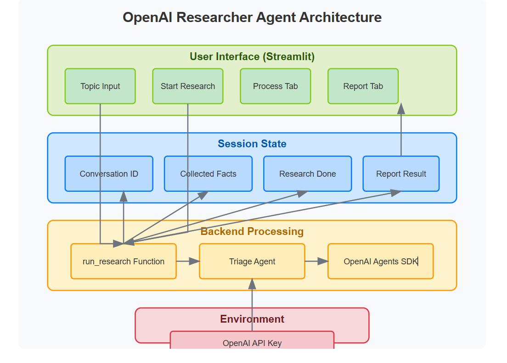

# Customer Support Agent Query Processing

## Problem Statement

In customer support and query resolution, it is crucial to efficiently classify and handle queries based on their nature. Manual query processing is time-consuming and inefficient. We need an automated workflow that:

- Categorizes incoming queries.
- Analyzes their sentiment.
- Routes them to the correct department (Technical, Billing, General).
- Escalates if necessary.
- Concludes successfully after processing.

## ✅ Solution Approach

We implement a state-based workflow using a langGraph, ensuring queries pass through well-defined steps:

1. **Categorization:** Identify the type of query.
2. **Sentiment Analysis:** Assess sentiment to determine urgency.
3. **Routing:** Direct the query to the appropriate handling unit.
4. **Handling:** Process the query as per category.
5. **Escalation (if needed):** If unresolved, escalate the query.
6. **End the process** after handling.



## 🛠 Installation Steps

**Prerequisites**
Ensure you have Python installed (>=3.8) and required dependencies.

**1. Clone the Repository**
```bash
git clone https://github.com/your-repo-name.git
cd your-repo-name
```

**2. Create a virtual environment**
```bash
conda create -p env python=3.10 -y
```

**3. Install dependencies**
```bash
pip install -r requirements.txt
```

**4. Run application**
```bash
streamlit run main.py
```

### Sample Queries to Test
1. My internet is not working.
2. I was charged twice for the same transaction.
3. The service is terrible!

## Future Enhancements

1. Implement a database to track query resolution.
2. Integrate AI-powered sentiment analysis.
3. Provide a frontend dashboard for query tracking.

## For Mentorship Connect me here [Click here](https://topmate.io/shivan_kumar1)
